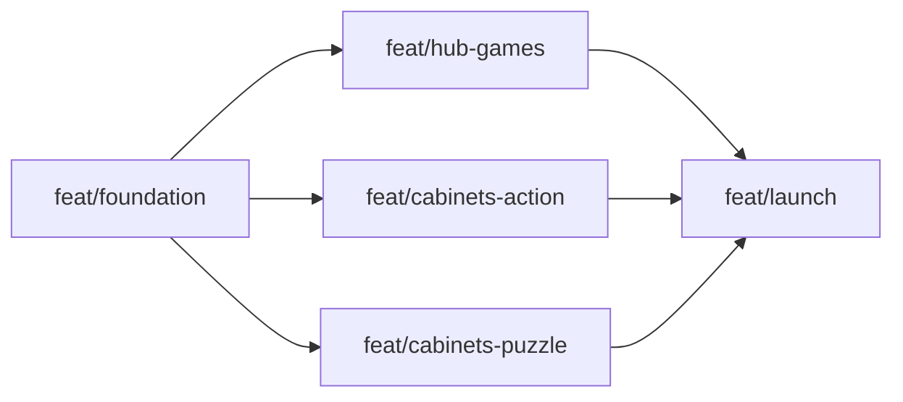

# Approach: arcade-buildout

## Strategy

Phased with a parallel middle. One foundation partition builds every shared surface (runtime, styles, scaffolds, pipeline, deploy) and freezes it; three game partitions then run in parallel against that frozen contract, each owning disjoint directories; a final launch partition integrates and ships. The freeze is what makes the parallelism safe: after foundation merges, any change to `src/lib/`, `src/ui/`, or `src/styles/` from a game partition requires a Signal to peer branches.

The hub games partition is the largest (page chrome + 6 games) but the three ported games have reference implementations in the mockup, which offsets the size. The two cabinet partitions are split action vs. puzzle so their engines don't overlap (loop-driven canvas games vs. event-driven logic games).

## Partitions (Feature Branches)

### Partition 1: Foundation → `feat/foundation`
**Modules**: `vite.config.ts`, `tsconfig.json`, `package.json`, `vercel.json`, `src/lib/*`, `src/ui/card.ts`, `src/ui/cabinet.ts`, `src/styles/*`, `src/sprites/*`, `scripts/gen-sprites.ts`, `src/tests/` (lib tests)
**Scope**: Vite MPA scaffold with TS strict; port Light Film Room tokens + pixel layer to CSS modules; fonts via Fontsource; `storage`/`audio`/`input`/`loop`/`screen` libs; `hub.ts` + `cartridge.ts` (the full wake/sleep/fullscreen/key-routing contract); card + cabinet scaffolds with veil/LED/⛶; sprite pipeline (ASCII maps → generated SVG module); Vitest wiring with `storage` + `loop` tests; a demo page proving the contract (one throwaway test cartridge); Vercel preview deploy working. Repo cleanup: remove `pyproject.toml`.
**Dependencies**: None

#### Artifact Type
web-ui

#### How to Run
- start: `npm run dev` (Vite, http://localhost:5173)
- ready-check: `GET http://localhost:5173/ returns 200`
- teardown: `Ctrl+C`

#### Acceptance Criteria
- [x] `npm run build` emits a static `dist/` with the hub shell + demo cartridge; `npm run preview` serves it <!-- verified: all 9 pages return 200 via preview + curl; demo JS 5.9 KB gz -->
- [x] `tsc --noEmit` and `npm test` pass; storage tests cover fallback-on-corrupt-JSON and `clearAll` scoping to `arcade:*` <!-- verified: 21 tests green across storage/loop/input/sprites -->
- [ ] Demo cartridge proves the contract: click wakes (LED on, veil off); click-away pauses under veil; Esc pauses; `F`/⛶ toggles CSS fullscreen; arrow keys scroll the page whenever no game is awake <!-- implemented as a faithful typed port of the mockup Hub; NEEDS a real-browser pass by the Builder — no browser automation was available to the implementation agent -->
- [x] `npm run sprites` regenerates `src/sprites/generated.ts` from an ASCII map; output SVG uses only palette colors and `shape-rendering="crispEdges"` <!-- verified: regeneration idempotent; specs assert palette-only fills + crispEdges + generated-in-sync -->
- [ ] A Vercel preview URL serves the built site <!-- NEEDS MANUAL REVIEW — vercel.json + insights tags committed; CLI unauthenticated, Builder must link/deploy the project -->
- [ ] Touch smoke test on a real device: tap wakes the demo cartridge, swipe on an awake game does not scroll the page, swipe elsewhere does <!-- NEEDS MANUAL REVIEW -->

#### Implementation Steps
1. Scaffold Vite MPA + TS strict + Vitest; commit lockfile.
2. Port CSS system (tokens → base → arcade layers) from mockup + `style-guide copy/design.md`; wire Fontsource fonts.
3. Build `storage.ts`, `audio.ts`, `loop.ts`, `screen.ts`, `input.ts` with tests where pure.
4. Build `cartridge.ts` + `hub.ts` (typed port of mockup Hub incl. key-routing invariant), `card.ts`, `cabinet.ts`.
5. Port `build.py` sprite generation to `scripts/gen-sprites.ts` + `maps.ts`.
6. Demo cartridge page; manual contract check; Vercel project + preview deploy.

### Partition 2: Hub & hub games → `feat/hub-games`
**Modules**: `index.html`, `src/pages/hub.ts`, `src/ui/ticker.ts`, `src/ui/scoreboard.ts`, `src/games/{dino,g2048,miner,simon,memory,lightsout}/*`, `style-guide/index.html`, hub game tests
**Scope**: Full hub page per the mockup: header (SND toggle, credits, INSERT COIN), ticker, hub-games grid, Cabinets grid (all cards SOON until launch partition flips them), high-scores panel + reset flow, controls legend, `/style-guide` page. Port Dino Run, 2048, Token Miner at feature parity (mockup-compatible storage keys); build Simon, Memory, Lights Out as new cartridges.
**Dependencies**: Requires Partition 1

#### Artifact Type
web-ui

#### How to Run
- start: `npm run dev`
- ready-check: `GET http://localhost:5173/ returns 200`
- teardown: `Ctrl+C`

#### Acceptance Criteria
- [ ] All six hub games playable end-to-end with wake/sleep/veil/fullscreen behavior identical across them; Miner is `alwaysOn` (never veiled, ticks while other games run) <!-- implemented: all six registered through the same card.ts/Hub path; miner alwaysOn (started at registration, no veil); NEEDS a real-browser pass by the Builder -->
- [x] Ported games match mockup behavior: 2048 restores a saved board on reload; Dino best persists; Miner grants capped (≤4 h) offline earnings with a toast <!-- verified in code + tests: 2048:state restored w/ over-state re-shown; best:dino persisted; applyOffline capped/clamped with 9 specs; toast copy per ux.md -->
- [x] `logic.ts` tests green: 2048 slide/merge/game-over, miner offline math (incl. negative clock delta), Lights Out generated boards always solvable <!-- verified: 50 tests green (12 g2048, 9 miner, 8 lightsout + foundation 21) -->
- [ ] Key-routing checklist passes on the hub: fresh load scrolls; awake game plays; click-away restores scroll; Simon/Memory/Lights Out (mouse games) never capture arrows <!-- static audit clean (hub.ts sole document listener/preventDefault owner; mouse games claim zero keys); NEEDS a real-browser pass by the Builder -->
- [x] Reset flow clears only `arcade:*` keys after inline YES confirmation; scoreboard zeroes; toast shown <!-- verified in code: store.clearAll scoping unit-tested in foundation; inline SURE?/YES/NO per ux; per-game onReset hooks zero cards; SAVE DATA CLEARED note -->
- [ ] Hub visually matches the mockup side-by-side (spacing, pills, LEDs, veils, ticker) <!-- NEEDS MANUAL REVIEW -->

#### Implementation Steps
1. Hub page structure + chrome (header, ticker, panels, cabinets grid with SOON pills).
2. Port Dino → 2048 → Miner (in that order; each exercises more of the runtime).
3. Build Simon, Memory, Lights Out.
4. Scoreboard live-update + reset flow; `/style-guide` page; tests.

### Partition 3: Action cabinets → `feat/cabinets-action`
**Modules**: `games/snake/`, `games/bricks/`, `games/aim/`, `src/games/{snake,bricks,aim}/*`, `src/pages/cabinet-entry.ts`, action game tests
**Scope**: First real cabinets on the shared scaffold: Snake (grid, keyboard + swipe, speed ramp), Bricks (paddle via keyboard + pointer, lives, layouts), Aim Trainer (timed targets, hits/accuracy). Owns `cabinet-entry.ts` (the thin per-page bootstrapper) since it lands the first cabinet.
**Dependencies**: Requires Partition 1

#### Artifact Type
web-ui

#### How to Run
- start: `npm run dev`
- ready-check: `GET http://localhost:5173/games/snake/ returns 200`
- teardown: `Ctrl+C`

#### Acceptance Criteria
- [x] Three cabinet pages served at `/games/{snake,bricks,aim}/`, each on the shared scaffold: CLICK TO START veil, score/best row, ⛶ fullscreen, controls legend, `← HUB` link <!-- verified: preview 200 on all three; scaffold rendered by cabinet-entry.ts + createCabinet; Lighthouse a11y 100 on /games/snake/ -->
- [x] Key-routing: cabinet page scrolls normally until the game is woken; Esc pauses; game-over screens release nav keys they no longer need <!-- verified in code: no doc-level listeners/preventDefault outside hub.ts; game over sleeps the cartridge (Hub.sleep) and restyles the veil, so nav keys route back to the page; browser pass -> Builder -->
- [x] Snake playable with arrows/WASD and swipe on touch; Bricks paddle follows pointer and arrows; Aim Trainer records hits/accuracy and persists best <!-- verified in code + 9 snake logic specs; touch halves need the Builder's device pass -->
- [x] Bests persist under `arcade:best:{game}` and survive reload <!-- best:snake / best:bricks / best:aim via store with number validators; snake row + ticker stat added on the hub -->
- [ ] Feels fair and 60 fps on a mid-tier laptop <!-- NEEDS MANUAL REVIEW -->

#### Implementation Steps
1. `cabinet-entry.ts` + first cabinet (Snake) proving the scaffold end-to-end.
2. Bricks; 3. Aim Trainer; 4. Touch pass on all three.

### Partition 4: Puzzle cabinets → `feat/cabinets-puzzle`
**Modules**: `games/minesweeper/`, `games/water-sort/`, `games/setrit/`, `src/games/{minesweeper,watersort,setrit}/*`, puzzle logic tests
**Scope**: Minesweeper (three difficulties, first-click-safe, flags incl. long-press, timer + best times), Water Sort (reverse-pour level generation, legal-pour validation, undo), Setrit (7 pieces, rotation with basic kicks, line clears, levels, next preview, soft/hard drop). Heaviest pure-logic partition; every game has a tested `logic.ts`.
**Dependencies**: Requires Partition 1 (uses the cabinet scaffold from `src/ui/cabinet.ts`; if it starts before Partition 3 lands `cabinet-entry.ts`, coordinate via Signal on who lands it first)

#### Artifact Type
web-ui

#### How to Run
- start: `npm run dev`
- ready-check: `GET http://localhost:5173/games/setrit/ returns 200`
- teardown: `Ctrl+C`

#### Acceptance Criteria
- [x] Three cabinet pages at `/games/{minesweeper,water-sort,setrit}/` on the shared scaffold with the standard cabinet behaviors <!-- verified: preview 200; same cabinet-entry scaffold as P3; LH a11y 100 on minesweeper + water-sort -->
- [x] Logic tests green: Minesweeper (first click never a mine; flood reveal; counts correct), Water Sort (only legal pours; undo restores; generated levels solvable by construction), Setrit (rotation/collision/line-clear/scoring) <!-- 26 new specs (8 ms incl. 50-seed safety sweep, 8 ws incl. 25-seed replay-solvability, 10 setrit); 85 total green -->
- [x] Minesweeper: long-press flags on touch; timer runs only while awake; best times per difficulty persist <!-- verified in code (timer interval only lives between start()/stop()); long-press on-device check -> Builder -->
- [x] Setrit: soft + hard drop, next-piece preview, level speed ramp; best persists <!-- verified in code + gravity/level specs -->
- [ ] Rotation and clearing feel standard to a Tetris player <!-- NEEDS MANUAL REVIEW -->

#### Implementation Steps
1. Minesweeper logic + UI; 2. Water Sort logic + UI; 3. Setrit logic (largest — timebox per tech-design risk) + UI; 4. Touch pass.

### Partition 5: Launch → `feat/launch`
**Modules**: `src/ui/ticker.ts` (stats wiring), `index.html` (pill flips), `src/ui/scoreboard.ts` (cabinet rows), docs (`README.md` game-addition guide), `vercel.json`/domain
**Scope**: Flip the six cabinet cards to LIVE; add cabinet bests to scoreboard + ticker; full key-routing checklist on Chrome/Firefox/Safari + one touch device; a11y pass (focus order, aria-labels, aria-live veil announcements, reduced-motion audit); payload audit vs. the 100 KB budget; naming double-check per resolved PRD policy (Simon only); README game-addition guide; production cutover to `arcade.cartercripe.com` and verification that Vercel Web Analytics receives page views.
**Dependencies**: Requires Partitions 2, 3, 4

#### Artifact Type
web-ui

#### How to Run
- start: `npm run dev`
- ready-check: `GET http://localhost:5173/ returns 200`
- teardown: `Ctrl+C`

#### Acceptance Criteria
- [x] All six cabinet cards LIVE and linking correctly; zero SOON cards among the six; remaining mockup cards still SOON <!-- completed across the cabinet partitions, finished 2026-07-13 (launch task 70 closed on feat/cabinets-puzzle) -->
- [x] Scoreboard + ticker include cabinet stats and update from localStorage <!-- SNAKE / MINESWEEPER BEG / SETRIT scoreboard rows (2s refresh) + SNAKE/SETRIT ticker stats; done with the cabinets 2026-07-13 -->
- [x] `npm run build` output meets the <100 KB gz hub JS budget (documented in the task) <!-- verified: 11.1 kB gz total hub JS (task 73) -->
- [x] Lighthouse Accessibility ≥ 95 on hub and one cabinet <!-- verified headless: 100 hub, 100 /demo/ (cabinet scaffold — no real cabinet yet), 100 style-guide; re-run on real cabinets when they land -->
- [ ] Key-routing checklist signed off on 3 desktop browsers + 1 touch device <!-- NEEDS MANUAL REVIEW -->
- [ ] Production deploy serves at `arcade.cartercripe.com`; Vercel Web Analytics shows page views from a production visit <!-- NEEDS MANUAL REVIEW -->

#### Implementation Steps
1. Wire cabinet scores into scoreboard/ticker; flip pills.
2. Cross-browser/touch checklist + fixes; a11y pass; payload audit.
3. README guide; domain cutover; final smoke test.

## Sequencing

Partition 1 is strictly first. Partitions 2, 3, 4 run in parallel after it (disjoint module ownership; shared code frozen). Partition 5 runs last.



### Partitions DAG

```yaml partitions
- name: feat/foundation
  modules: [src/lib, src/ui, src/styles, src/sprites, scripts, vite.config.ts, vercel.json]
  depends_on: []

- name: feat/hub-games
  modules: [index.html, src/pages/hub.ts, src/games/dino, src/games/g2048, src/games/miner, src/games/simon, src/games/memory, src/games/lightsout, style-guide]
  depends_on: [feat/foundation]

- name: feat/cabinets-action
  modules: [games/snake, games/bricks, games/aim, src/games/snake, src/games/bricks, src/games/aim, src/pages/cabinet-entry.ts]
  depends_on: [feat/foundation]

- name: feat/cabinets-puzzle
  modules: [games/minesweeper, games/water-sort, games/setrit, src/games/minesweeper, src/games/watersort, src/games/setrit]
  depends_on: [feat/foundation]

- name: feat/launch
  modules: [src/ui/ticker.ts, src/ui/scoreboard.ts, index.html, README.md]
  depends_on: [feat/hub-games, feat/cabinets-action, feat/cabinets-puzzle]
```

## Migrations & Compat

No existing users or data migrations. Best-effort continuity with mockup-era localStorage (ADR-4): keep mockup key names where value shapes match. The mockup file itself stays in the repo untouched as reference; it is not served by the site.

## Risks & Mitigations

| Risk | Mitigation |
|------|------------|
| Game partitions need a `src/lib` change after the freeze | Allowed but requires a Signal + peers rebase; foundation's demo cartridge should surface contract gaps early |
| Partition 3 and 4 both need `cabinet-entry.ts` on day one | P3 owns it; if P4 starts first, it lands a minimal version and Signals — either way it's <50 lines |
| Hub partition balloons (6 games + all chrome) | Ported games have reference implementations; if it drags, Simon/Memory/Lights Out can slip to the launch partition without breaking parallelism |
| Setrit scope creep | Timeboxed "standard-feeling" bar set in tech design; logic tests define done |
| Fullscreen/veil CSS conflicts between hub cards and cabinet pages | Both consume the same `card.ts`/`arcade.css` primitives built in foundation — divergence requires touching frozen code, which triggers the Signal rule |

## Alternatives Considered

- **Two partitions (foundation + everything else):** simpler, but serializes ~9 games behind one branch and loses the parallel middle; rejected.
- **One partition per game (12 branches):** maximal parallelism, but per-branch overhead swamps game size, and cross-game consistency review gets harder; rejected.
- **Cabinets split by engine reuse (loop games vs. grid games) instead of action/puzzle:** nearly the same grouping in practice; action/puzzle chosen because it also balances effort (P4 is logic-heavy, P3 is feel-heavy).
- **Hub chrome as its own partition before games:** the chrome is only provable with real games in it; folding them together avoids a fourth sync point.
