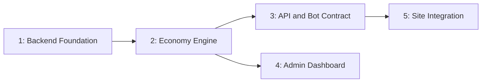

# Approach: Token System

**Pace: `all`** — full spec chain drafted without stopping; consolidated review happens after Tasks. PR preference: **None** (set at start-flow) — `create-lifecycle` already run with `--no-pr-initiatives --no-pr-features`.

## Strategy

Mostly sequential with two points of parallelism. The backend has a hard bottom-up dependency chain (schema/auth before business logic before API before consumers), so `foundation` and `economy-engine` are strictly ordered. Once the economy logic exists, `api-and-bot-contract` and `admin-dashboard` can proceed in parallel since both only *read* the `lib/` functions economy-engine produces and don't depend on each other. `site-integration` is last and gated on the API contract being stable, since it's the one partition that touches the existing static site rather than the new backend.

`foundation` is the only partition with no prerequisites and gets its own worktree; everything else is a plain sequential branch off its dependency.

## Partitions (Feature Branches)

### Partition 1: Backend Foundation → `feat/backend-foundation`
**Modules**: `arcade-backend/lib/db`, `arcade-backend/lib/auth.ts`, `arcade-backend/lib/ledger.ts`, `arcade-backend/drizzle`
**Scope**: Scaffold the Next.js project at `arcade-backend/`, Drizzle schema + initial migration (all tables per Tech Design Data Models), Neon DB provisioning, Auth.js config (Google provider), `lib/ledger.ts` (the one ledger-write helper, ADR-2), seed script for the `games` table with the current hub/cabinet roster and costs.
**Dependencies**: None

#### Artifact Type
full-stack

#### How to Run
- start: `cd arcade-backend && npm run dev` (confirmed: `next dev --port 3001`)
- ready-check: `GET http://localhost:3001/api/health returns 200`
- teardown: `Ctrl+C`

#### Acceptance Criteria
- [ ] `npm run db:migrate` (confirmed script name) applies the initial schema to a local/dev Postgres with zero errors — blocked on Neon provisioning (Builder manual step, see arcade-backend/README.md)
- [ ] `POST /api/ledger` (internal test-only route, or a direct `lib/ledger.ts` unit test) writing a transaction results in `GET /api/balance` reflecting the correct `SUM(amount)` for that user
- [ ] Visiting `/api/auth/signin` redirects to Google's OAuth consent screen
- [ ] `games` table contains one row per existing hub cartridge/cabinet with the correct tier and token cost (1 for cartridge, 3 for cabinet) after running the seed script

#### Implementation Steps
1. Scaffold `arcade-backend/` as a Next.js App Router project; add `arcade-backend/vercel.json` (or Vercel project config) scoped to this directory per ADR-1.
2. Provision Neon Postgres via Vercel Marketplace; wire `DATABASE_URL`.
3. Write `lib/db/schema.ts` per Tech Design Data Models; generate and apply the initial Drizzle migration.
4. Implement `lib/ledger.ts` — the sole function permitted to insert `transactions` rows.
5. Configure Auth.js with the Google provider; stub the Discord provider for later linking (full Discord OAuth wiring can land with this partition or be deferred to site-integration if account-linking UX needs it — confirm during Tasks).
6. Write and run a seed script populating `games` from the existing roster.
7. Unit tests for `lib/ledger.ts` (balance reconstruction from ledger).

---

### Partition 2: Economy Engine → `feat/economy-engine`
**Modules**: `arcade-backend/lib/achievements.ts`, `arcade-backend/lib/leaderboard.ts`, `arcade-backend/lib/content.ts`
**Scope**: Achievement evaluation (threshold + interval-gap modes, ADR-3/ADR-5 idempotency), daily leaderboard computation (midnight cutoff, 2+-submitter gating, participation award, default-award fallback of `games.default_top_score_award`), spend logic (`lib/spend.ts` or folded into ledger consumer), riddle/trivia/task completion logic (`lib/content.ts` — once-per-day enforcement for riddle/trivia, unlimited for task; content rows are seeded directly, no authoring logic needed here).
**Dependencies**: Requires `feat/backend-foundation` (needs schema + ledger helper)

#### Artifact Type
library

#### How to Run
_(no persistent process — pure library, exercised via unit tests)_

#### Acceptance Criteria
- [ ] `evaluateScoreSubmission({ score: 1050, ... })` against a seeded `lastAwardedHighScore: 1000, gap: 100` interval-gap achievement returns no award, but updates `currentHighScore`
- [ ] A subsequent `evaluateScoreSubmission({ score: 1100, ... })` against the same state returns exactly one award and inserts exactly one `achievement_awards` row
- [ ] Calling `evaluateScoreSubmission` twice with identical input (simulated retry) never produces two `transactions` rows for the same achievement (ADR-3 idempotency)
- [ ] `computeDailyLeaderboard(gameId, date)` with only one submitter for that game/date returns no top-score award, but the submitter still receives the participation award
- [ ] `computeDailyLeaderboard(gameId, date)` with two or more submitters correctly identifies the top scorer for bounty/award purposes
- [ ] `completeContentItem(userId, contentItemId, answerText)` for a `type: 'riddle'` item awards tokens on first completion today, and returns `already_completed_today` (no award) on a second attempt the same day
- [ ] `completeContentItem` for a `type: 'task'` item awards tokens on every call, with no once-per-day restriction

#### Implementation Steps
1. Implement `lib/achievements.ts`: threshold mode, interval-gap mode (reading/writing `high_scores.last_awarded_high_score`), `ON CONFLICT DO NOTHING` idempotency per ADR-3.
2. Implement `lib/leaderboard.ts`: midnight-cutoff day bucketing, participation award (+5, always), 2+-submitter top-score gating, default-award fallback (`games.default_top_score_award`) when no bounty is set for the day.
3. Implement `lib/spend.ts`: deduct-before-play, `InsufficientBalanceError` domain error.
4. Implement `lib/content.ts`: riddle/trivia/task completion, once-per-day enforcement scoped to `type in ('riddle', 'trivia')` only.
5. Full unit test coverage per Tech Design Testing Pattern (100% target on these four files).

---

### Partition 3: API & Bot Contract → `feat/api-and-bot-contract`
**Modules**: `arcade-backend/app/api`
**Scope**: All route handlers (`/api/balance`, `/api/spend`, `/api/scores/submit`, `/api/bounty/pending`, `/api/bounty/set`, `/api/users/by-discord-id`, `/api/content`, `/api/content/complete`), `zod` request validation, service-API-key middleware for bot-only routes, CORS allow-listing for the arcade site origin. Ends with the API contract published for Carter's separate Discord bot build (Tech Design Implementation Sequence step 6 — a documentation handoff, not code). No content-authoring routes (create/edit/delete `content_items`) are built here — deliberately deferred per PRD Open Questions.
**Dependencies**: Requires `feat/economy-engine`

#### Artifact Type
rest-api

#### How to Run
- start: `cd arcade-backend && npm run dev` (confirmed: `next dev --port 3001`)
- ready-check: `GET http://localhost:3001/api/health returns 200`
- teardown: `Ctrl+C`

#### Acceptance Criteria
- [ ] `GET /api/balance` with a valid session returns `200` with `{ balance: number, recent: Transaction[] }`
- [ ] `GET /api/balance` with no session returns `401`
- [ ] `POST /api/spend` with `{ gameId: "dino-run" }` and sufficient balance returns `200` with `{ ok: true, newBalance }`; with insufficient balance returns `402` with `{ ok: false, error: "insufficient_balance", required, balance }`
- [ ] `POST /api/scores/submit` with a valid session and a new personal-best score returns `200` with `awards` containing the expected achievement entry when criteria are met
- [ ] `POST /api/scores/submit` using a valid service API key (no user session) succeeds when `discordId` resolves to a linked account, and returns `404` when it does not
- [ ] `POST /api/bounty/set` without a valid service API key returns `401`
- [ ] `GET /api/users/by-discord-id?discordId=X` returns `200` with `{ userId, displayName }` for a linked account and `404` otherwise
- [ ] `GET /api/content` returns `200` with an empty `items` array when no content is seeded (expected at launch), and correct `completedToday` flags once items exist
- [ ] `POST /api/content/complete` on a `riddle`/`trivia` item awards tokens once, then returns `{ ok: false, error: "already_completed_today" }` on a same-day retry; on a `task` item it awards tokens every call
- [ ] A request from a non-allow-listed origin is rejected by CORS <!-- NEEDS MANUAL REVIEW: exact test harness for CORS behavior TBD -->

#### Implementation Steps
1. Implement service-API-key middleware (constant-time comparison against `BOT_API_KEY` env var).
2. Implement each route handler per the Tech Design API & Interface Design contract, delegating to `lib/` functions from Partitions 1-2.
3. Configure CORS to allow-list the arcade site's production + preview origins.
4. Write the published API contract doc (`docs/discord-bot-api.md` or similar) summarizing every bot-relevant endpoint for Carter's handoff.
5. Route-level integration tests (supertest-style or Next.js route handler test harness) covering the Acceptance Criteria above.

---

### Partition 4: Admin Dashboard → `feat/admin-dashboard`
**Modules**: `arcade-backend/app/admin`
**Scope**: Users list + transaction drill-down (UX Mock-Up 1), achievement builder (CRUD on `achievements` table), game/cabinet config management (cost editing, daily entry edit/delete), bot log view (read-only `bot_log_events`), basic analytics view. Admin-only auth guard (`users.isAdmin`).
**Dependencies**: Requires `feat/economy-engine` (reads/writes the same `lib/` functions and tables)

#### Artifact Type
web-ui

#### How to Run
- start: `cd arcade-backend && npm run dev` (confirmed: `next dev --port 3001`)
- ready-check: `GET http://localhost:3001/admin/users returns 200 for an authenticated admin session`
- teardown: `Ctrl+C`

#### Acceptance Criteria
- [ ] Visiting `/admin/users` as a non-admin authenticated user returns `403` or redirects away, per Tech Design Security table
- [ ] Visiting `/admin/users` as the admin account renders the user list with balance and last-active columns matching UX Mock-Up 1
- [ ] Clicking a user row renders their transaction log inline without a full page navigation
- [ ] Using "Adjust balance" to change a value from 40 to 55 creates a transaction with `reason = "Admin adjusted 40 -> 55"`, visible in both the admin drill-down and (on next fetch) the user's own `/api/balance` recent list
- [ ] Adding an achievement criteria row in the builder for a game persists it and it appears in the list without a page reload
- [ ] An empty achievement list for a game renders the copy `"No achievements configured for this game yet."` per UX Copy & Tone

#### Implementation Steps
1. Implement Auth.js session guard + `isAdmin` check as shared admin layout middleware.
2. Build users list + transaction drill-down page per UX Mock-Up 1 (`admin-users.html`).
3. Build achievement builder (inline criteria-row CRUD) per UX Flow 2.
4. Build game/cabinet config management, daily leaderboard entry edit/delete, bot log view, basic analytics view.
5. Component/page tests for the balance-edit confirm flow and achievement builder empty/populated states.

---

### Partition 5: Arcade Site Integration → `feat/site-integration`
**Modules**: `src/ui`, `src/lib` (existing `arcade` repo tree, NOT `arcade-backend/`)
**Scope**: Balance pill + toast widget in the existing header (UX Mock-Up 2), API-client fetch wrapper, Google sign-in entry point, spend-before-play wiring on hub cartridge and cabinet game starts, minimal "Account" surface (Discord link step, own transaction log view) per UX Information Architecture.
**Dependencies**: Requires `feat/api-and-bot-contract` (needs a stable API to call)

#### Artifact Type
web-ui

#### How to Run
- start: `npm run dev` (existing Vite dev server, per current `vite.config.ts`)
- ready-check: `GET http://localhost:5173/ returns 200` (confirmed: `vite`'s default port, no override in vite.config.ts)
- teardown: `Ctrl+C`

#### Acceptance Criteria
- [ ] Header renders the "Sign in with Google" control when signed out, and the balance pill (LED + numeric balance) when signed in, per UX Mock-Up 2
- [ ] Setting a new high score in Dino Run that meets an achievement criterion triggers a toast reading `+15 High Score: Dino Run` (or the configured amount) within the same session, without a page reload
- [ ] Attempting to start a cabinet game with a balance below its token cost shows the inline `"Need {N} tokens"` veil and does not start the game
- [ ] Starting a hub cartridge game with sufficient balance deducts the correct cost and updates the visible balance pill
- [ ] `prefers-reduced-motion` disables the toast slide-in animation (fades instead), per UX Responsive & Accessibility
- [ ] A backend outage (API unreachable) does not block gameplay — games remain playable, balance pill shows a degraded/unavailable state instead of erroring the page <!-- NEEDS MANUAL REVIEW: exact degraded-state UI not fully specified in UX doc, confirm during Tasks -->

#### Implementation Steps
1. Add an API-client module (`src/lib/tokenApi.ts`) wrapping fetch calls to the backend, with graceful-degradation handling per Tech Design Brownfield Notes.
2. Add the balance pill + toast component to the existing header, wired to `GET /api/balance` and to score-submission responses.
3. Wire spend calls (`POST /api/spend`) into the existing `Hub.register(...)` cartridge/cabinet start flow, blocking game start on insufficient balance.
4. Wire score submission (`POST /api/scores/submit`) into each game's existing game-over/score-save path.
5. Build the minimal Account surface (Discord link CTA, own transaction log).
6. Manual + automated a11y check (reduced-motion, `aria-live` toast) consistent with the site's existing accessibility commitments.

---

## Sequencing



### Partitions DAG

```yaml partitions
- name: feat/backend-foundation
  modules: [arcade-backend/lib/db, arcade-backend/lib/auth.ts, arcade-backend/lib/ledger.ts, arcade-backend/drizzle]
  depends_on: []                    # parallel — gets its own worktree

- name: feat/economy-engine
  modules: [arcade-backend/lib/achievements.ts, arcade-backend/lib/leaderboard.ts, arcade-backend/lib/spend.ts]
  depends_on: [feat/backend-foundation]

- name: feat/api-and-bot-contract
  modules: [arcade-backend/app/api]
  depends_on: [feat/economy-engine]

- name: feat/admin-dashboard
  modules: [arcade-backend/app/admin]
  depends_on: [feat/economy-engine]

- name: feat/site-integration
  modules: [src/ui, src/lib]
  depends_on: [feat/api-and-bot-contract]
```

`feat/api-and-bot-contract` and `feat/admin-dashboard` both depend only on `feat/economy-engine`, not on each other — once economy-engine merges, they can be worked in any order or interleaved; they don't share module scope so there's no merge-conflict risk between them.

## Migrations & Compat

This is a greenfield schema (Tech Design: no modified models), so there's no existing-data migration to plan for on the backend side. On the arcade site side, `feat/site-integration` is purely additive — it must not change any existing game logic, the `Hub` registration contract, or localStorage keys already in use; games remain playable even if a user never signs in (balance/spend features degrade, core gameplay does not break, per FR-4's role as a new constraint layered on top of existing play).

## Risks & Mitigations

| Risk | Mitigation |
|------|------------|
| `feat/api-and-bot-contract` and `feat/admin-dashboard` both land changes to `arcade-backend/lib` consumers around the same time, risking silent behavior drift if economy-engine's contract shifts after both branch off it | Freeze `lib/achievements.ts` / `lib/leaderboard.ts` public function signatures at the end of Partition 2; any signature change after that point triggers a Signal to both dependent partitions |
| `feat/site-integration` is the only partition touching the existing static site — if it lands with a bug, it could regress the click-to-wake/fullscreen game model that's the whole point of the existing site | Acceptance criteria explicitly require gameplay to remain functional during a simulated backend outage; manual regression pass against the existing hub interaction model (click-to-wake, pause-on-click-away, Escape/fullscreen) before this partition is considered done |
| Neon connection-pooling behavior under Vercel Fluid Compute (flagged as an implementation risk in Tech Design) could block Partition 1 if it surfaces late | Spike this specifically within `feat/backend-foundation` before building on top of the DB client — it's foundational and blocks every other partition |
| Two Vercel projects in one repo (ADR-1) is an unusual-enough setup that Root Directory misconfiguration could deploy the wrong project or leak the backend's env vars into the site's build | Verify both Vercel project configs (Root Directory + env var scoping) explicitly as part of `feat/backend-foundation`'s definition of done, before any other partition starts depending on a live deployment |

## Alternatives Considered

- **Bolting `/api` routes directly onto the existing static Vite site** — rejected per ADR-1; would require converting the site's build off its current zero-build-step-feeling static setup.
- **A fully separate git repository for the backend** — rejected per the revised ADR-1; would fracture Cicadas partitioning/worktree/Signal mechanics across two disconnected histories for no real benefit at this project's scale.
- **Single monolithic partition (build the whole backend in one branch)** — rejected: the bottom-up dependency chain (schema -> logic -> API -> consumers) plus the genuine parallelism opportunity between API and admin dashboard work makes a multi-partition split both natural and higher-leverage than a single large branch.
